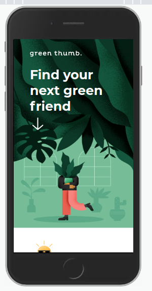
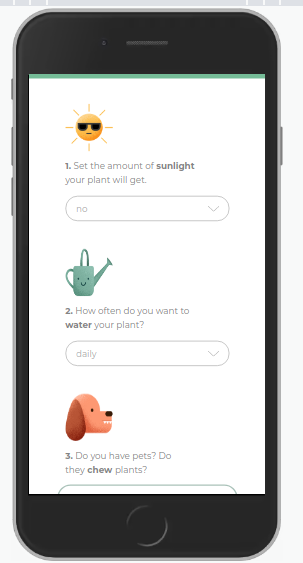
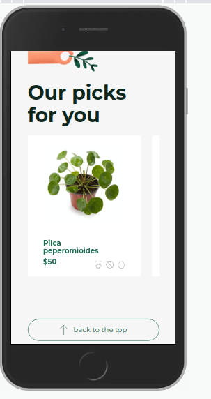
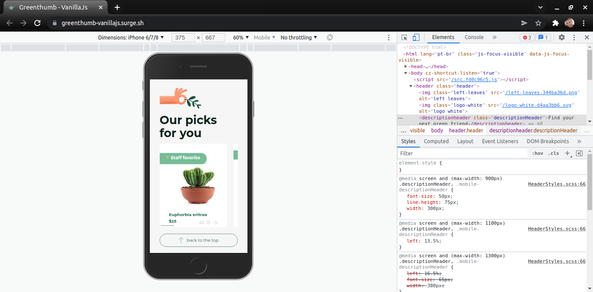
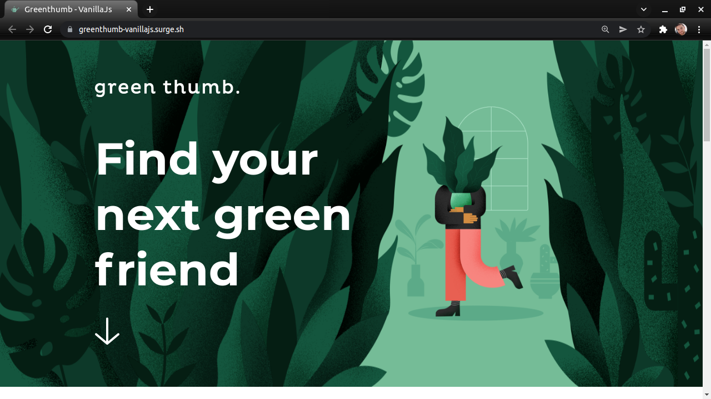
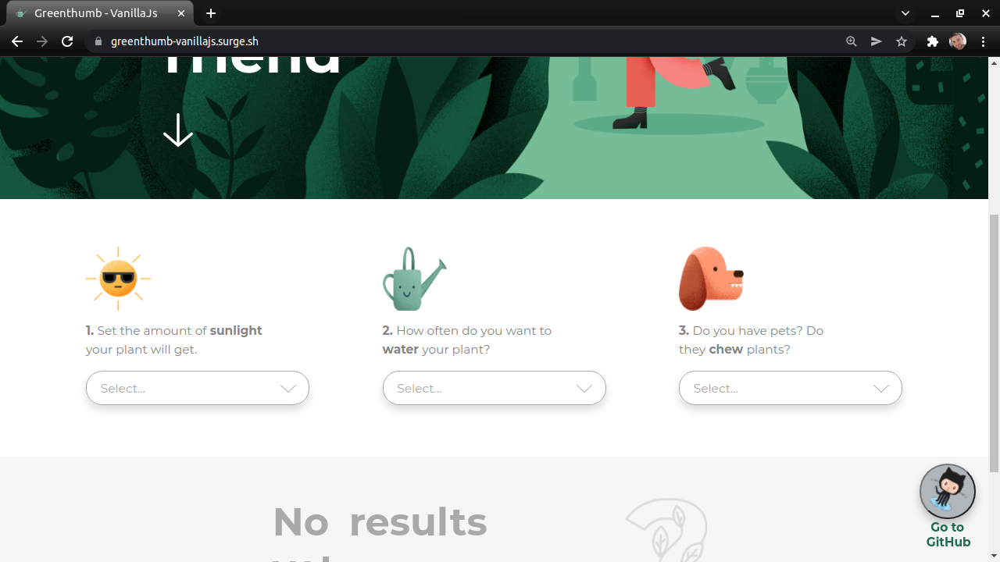
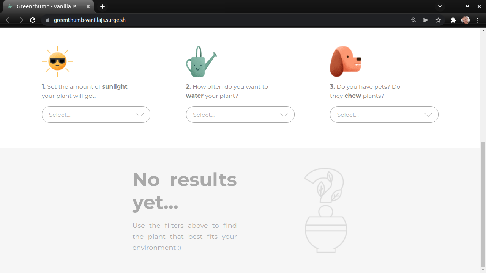
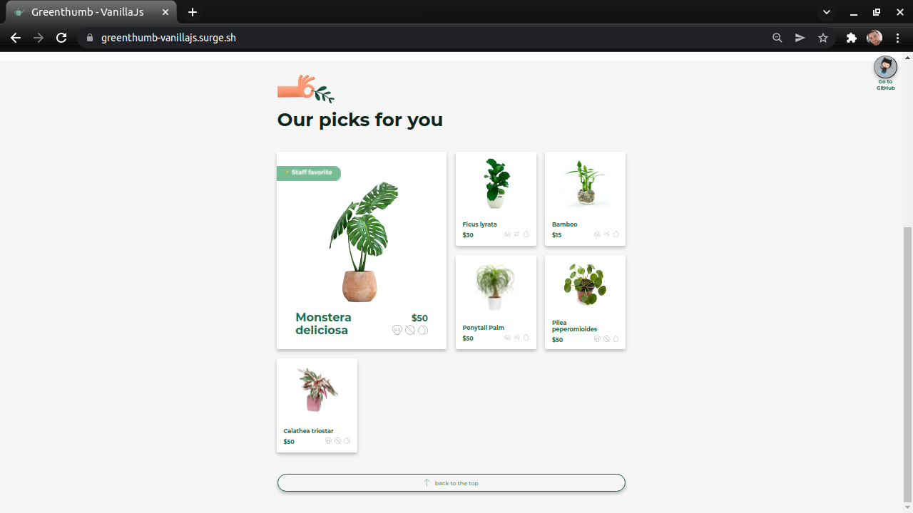

<h1 align="center"> Greenthumb-VanillaJs </h1><br/>

  <a align="center" href="https://greenthumb-vanillajs.surge.sh/" target="_blank"> 
  click here and browse this page, for more information about the page and download instructions continue =) </a>


<br/>

## **Greenthumb-VanillaJs** in a nutshell, it's a page where to display the best plant for you to buy, based on the match made on the page, the best plants to have is revealed after you match the amount of **sunlight** the plant will receive, how often you **water**, and finally if you have pets and if they **chew** plants.

<br>
<br/>


<h2 align="center"><strong> A little preview of the page</strong></h2>
<br/>

<P align="center"><strong> MOBILE </strong></P>

<section align="center">





<br/>
<p align="center"><strong>Navigation demo MOBILE</strong></p>


</section><br/>

<P align="center"><strong> DESKTOP </strong></P>

<section align="center">





<br/>
<p align="center"><strong>Navigation demo DESKTOP</strong></p>


</section> 

<br/>
<br/>
<br/>

## Next, the technologies and methodology used in the construction of the page.
<br/>

<a href="https://atomicdesign.bradfrost.com/chapter-2/"> 
</a>
<br/>

 used **Atomic Design Methodology** to organize the components 
 <br/>
 <br/>


<a href="http://vanilla-js.com/"> 
</a>
<br/>
made with **Vanilla JS**
<br/>
<br/>

[](https://docs.npmjs.com/cli/v7/commands/npm-install)
<br/>
made with **NPM**
<br/>
<br/>

<a href="https://parceljs.org/"> 
</a>
<br/>
made with **Parcel JS**
<br/>
<br/>

[](https://docs.npmjs.com/cli/v7/commands/npm-install)
<br/>
muse **SASS** for styling
<br/>
<br/>
## **Installation**

Browse to the folder where you want to place the page, open a terminal tab and type this command below to clone the project, follow the rest of the instructions to download

```bash
git clone https://github.com/J0se-Luiz/Greenthumb-VanillaJS.git
```

After the pagina `Greenthumb-VanillaJs` has been downloaded enter the following commands

```bash
 cd Greenthumb-VanillaJS
 npm install
```

All ready, now to open the page on your computer just type the following command

```bash
npm start
```
<br/>

 **END** =)
<br/>
<br/>
<br/>

post link on surge.sh
https://greenthumb-vanillajs.surge.sh/

<br/>
<br/>

code link in codesandbox
https://codesandbox.io/s/happy-wood-n7i7c

Open In New Window [codesandbox]
https://n7i7c.csb.app/


